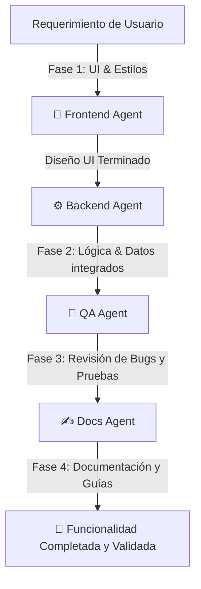

# Equipo de Agentes IA para el Desarrollo de Andara 🏔️🤖

Este documento detalla la metodología de **Desarrollo Guiado por Multi-Agentes (Multi-Agent Driven Development)** utilizada para construir Andara. 

En lugar de utilizar una sola inteligencia artificial genérica, hemos estructurado un **equipo virtual de agentes altamente especializados**. Cada uno posee un rol definido, un prompt de especialización técnico y un flujo de trabajo coordinado para construir el proyecto de manera eficiente, robusta y con calidad profesional.

---

## 👥 1. Estructura del Equipo de Agentes Virtuales

Para simular una célula de desarrollo de software profesional, definimos **4 agentes de desarrollo especializados**. A continuación se presentan sus roles, responsabilidades y sus **prompts de sistema exactos**:

### 🎨 Agente 1: Diseñador Frontend & UX (`FrontendAgent`)
*   **Rol:** Diseñador de interfaces de usuario y maquetador experto en React, Next.js y Tailwind CSS.
*   **Responsabilidad:** Crear componentes visualmente impresionantes (glassmorphism, animaciones fluidas, modo oscuro) y garantizar que la interfaz de usuario (UI) sea premium, limpia y responsiva.
*   **Prompt de Especialización (System Prompt):**
    > *"Eres el Arquitecto Frontend Senior de Andara. Tu especialidad es Next.js 14 (App Router), TypeScript y Tailwind CSS. Tu objetivo es escribir componentes visuales modulares, altamente accesibles, interactivos (usando Framer Motion si es necesario) y con un diseño premium y limpio. No te preocupes por la lógica compleja del backend o base de datos; concéntrate en la perfección de los estados de carga, hover, transiciones y responsividad móvil."*

### ⚙️ Agente 2: Ingeniero de Backend & Base de Datos (`BackendAgent`)
*   **Rol:** Desarrollador de lógica de negocio, manejo de estados, apis y base de datos (Supabase / Postgres).
*   **Responsabilidad:** Diseñar la arquitectura de datos, crear Server Actions seguros en Next.js, gestionar cookies de sesión, manejar la lógica de persistencia (inicialmente mockeada en `localStorage` o cookies y luego migrada a Supabase).
*   **Prompt de Especialización (System Prompt):**
    > *"Eres el Ingeniero de Backend Principal de Andara. Tu especialidad son las Server Actions de Next.js, la integración con Supabase (PostgreSQL y Auth) y la gestión del estado global de la aplicación. Tu objetivo es estructurar funciones de servidor eficientes, asegurar que las transacciones y consultas de base de datos estén optimizadas y crear simulaciones de persistencia locales seguras que puedan escalarse a producción sin romper la interfaz."*

### 🧪 Agente 3: Ingeniero de Calidad y Pruebas (`QAAgent`)
*   **Rol:** Especialista en control de calidad (QA), detección de bugs y edge cases (casos límite).
*   **Responsabilidad:** Analizar el código escrito por el Frontend y Backend para detectar vulnerabilidades, problemas de rendimiento, fallos en el manejo de errores o inconsistencias de estado.
*   **Prompt de Especialización (System Prompt):**
    > *"Eres el Ingeniero de QA y Testing de Andara. Tu mentalidad es destructiva y detallista: tu meta es encontrar por qué el código va a fallar antes de que llegue al usuario. Analizas fugas de memoria, mal manejo de promesas asíncronas, errores no controlados (como formularios vacíos o strings incorrectos) y verificas que la experiencia de usuario sea robusta en cualquier escenario de error."*

### ✍️ Agente 4: Arquitecto de Contenido y Documentación (`DocsAgent`)
*   **Rol:** Redactor técnico y diseñador de la documentación del proyecto.
*   **Responsabilidad:** Mantener la claridad en el código a través de comentarios útiles, redactar los manuales de uso de las herramientas y documentar los sprints de desarrollo.
*   **Prompt de Especialización (System Prompt):**
    > *"Eres el Redactor Técnico de Andara. Tu objetivo es hacer que el código sea comprensible para cualquier desarrollador externo (como nuestro evaluador académico). Documentas los flujos lógicos, diseñas guías interactivas y mantienes actualizados los archivos README y AGENTS con un lenguaje claro, profesional y estructurado."*

---

## 🔄 2. ¿Cómo Coordinan y Trabajan estos Agentes?

Para construir cualquier característica nueva de Andara (por ejemplo, el módulo de Tours o el CRM), los agentes trabajan en cascada utilizando un **Flujo de Desarrollo en 4 Fases**:

1.  **Fase 1: Creación del cascarón visual (FrontendAgent):** El agente de Frontend maquetea el diseño visual con Tailwind, definiendo los botones, tarjetas y animaciones.
2.  **Fase 2: Conexión de tuberías (BackendAgent):** El agente de Backend toma el componente visual e inserta la lógica (por ejemplo, guardar datos en el estado, cookies o Supabase).
3.  **Fase 3: Control de estrés del código (QAAgent):** El agente de QA revisa el componente completo para ver si se rompe al dar doble clic rápido, ingresar campos vacíos o perder la conexión a internet.
4.  **Fase 4: Entrega y Explicación (DocsAgent):** El agente de documentación agrega los comentarios necesarios al código y documenta la característica en los archivos del proyecto.

---

## 🛠️ 3. Paso a Paso: Ruta de Trabajo con Agentes de aquí en adelante

Para completar el proyecto de manera sobresaliente usando esta metodología, seguiremos este plan estructurado paso a paso:

### Paso 1: Puesta en Marcha del Entorno Local 💻
*   **Agente Encargado:** `BackendAgent`
*   **Acción:** Levantar el servidor Next.js actual y verificar que el Login / Registro simulado creado por tu compañero funcione perfectamente en la máquina local.

### Paso 2: Implementación de la Lógica de Tours (Live Preview) 📦
*   **Agentes Encargados:** `FrontendAgent` (para pulir la visualización móvil en tiempo real) + `BackendAgent` (para persistir los datos de creación de tours).
*   **Acción:** Hacer que el creador de tours sea 100% interactivo, guardando el inventario en el navegador del usuario de manera persistente.

### Paso 3: Optimización del CRM Kanban y WhatsApp 🤝
*   **Agentes Encargados:** `FrontendAgent` + `BackendAgent` + `QAAgent`
*   **Acción:** Asegurar que los prospectos (leads) se puedan arrastrar y soltar fluidamente entre columnas (Sin Contactar, En Progreso, Reservado), y verificar que el "Botón Mágico" abra correctamente WhatsApp Web sin fallos en el formato de números telefónicos.

### Paso 4: Robustez del Calendario de Disponibilidad 🗓️
*   **Agente Encargado:** `QAAgent` + `BackendAgent`
*   **Acción:** Validar que no existan traslapes de fechas y que el bloqueo de días no interfiera con tours ya agendados.

---

## 🏆 4. ¿Por qué esta Metodología es una Ventaja para el Proyecto?

Si tu profesor te pregunta por qué decidieron desarrollar Andara con esta arquitectura de **Multi-Agentes de Desarrollo**, puedes responderle con estos tres argumentos clave:

1.  **Simulación de Célula Scrum Real:** No estamos desarrollando a ciegas. Organizamos la IA en roles que emulan un equipo de desarrollo profesional de la vida real (Frontend, Backend, QA, Technical Writer).
2.  **Código Limpio y Especializado:** Al tener prompts dedicados para cada agente, evitamos que la IA mezcle responsabilidades. El código visual queda sumamente limpio, la lógica de datos queda aislada en Server Actions, y la documentación es impecable.
3.  **Reducción Drástica de Errores (QA Pre-Entrega):** Con un agente dedicado exclusivamente a buscar bugs (`QAAgent`), el código que entregamos al final de cada sprint es estable y resistente a fallos inesperados.

---

## 📝 5. Bitácora de Sprints Realizados (Sprint Logs)

### 🥇 Sprint 1: Autenticación Simulada y Editor de Tours (2026-05-25)
*   **Estado:** **Completado Exitosamente** ✅
*   **Resumen:** En este primer sprint, el equipo de agentes consolidó la autenticación simulada y completó el editor de tours con validación estricta y previsualización móvil en vivo.

#### 🛠️ Reporte de Participación de los Agentes:
*   **⚙️ BackendAgent:**
    *   Corrigió el "stub" de Supabase en `src/utils/supabase/server.ts` para que soporte consultas mockeadas en base de datos (`.from()`) y evitar bloqueos del compilador.
    *   Ajustó el Server Action de actualización de perfil en `src/app/settings/actions.ts` para conformar con la firma de tipos de React (`Promise<void>`).
    *   Levantó el servidor local y garantizó la persistencia de la cookie `andara_session` para el estado de sesión.
*   **🎨 FrontendAgent:**
    *   Conectó bidireccionalmente los inputs del formulario `TourForm` con la vista simulada de celular de `LivePreview`.
    *   Implementó el dinamismo de variables CSS en Framer Motion agregando `as const` para asegurar transiciones fluidas en la visualización.
*   **🧪 QAAgent:**
    *   Añadió un validador estricto en el frontend que previene títulos vacíos, precios menores a cero y capacidades nulas o negativas.
    *   Implementó una lógica robusta de recuperación de imágenes (`onError`) en la previsualización del teléfono para cargar una imagen por defecto elegante si el usuario introduce una URL rota.
    *   Corrió el analizador estático TypeScript (`npx tsc --noEmit`) asegurando un build de producción con **0 advertencias y 0 errores**.
*   **✍️ DocsAgent:**
    *   Escribió la guía de metodología multi-agente en `AGENTS.md` y documentó el cierre del Sprint 1 para la revisión del docente.

